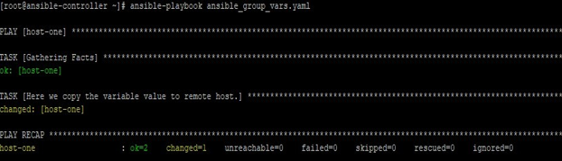
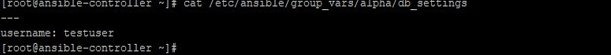
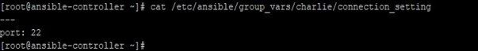
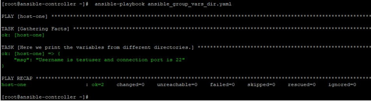

# Ansible group_vars examples

## Introduction to Ansible group_vars

In Ansible, we know that variables are very important as they store host-to-host data and usable to deploy some tasks based on remote host’s state-based. There are various ways to define variables like in the inventory file, in the playbook file, in a variable file imported in the playbook. Similarly, there is a way to define variables at a location from where the variables will be realized for a group of hosts. This location falls under group_vars and this can be under a predefined location. In this article, we will learn about group_vars with some examples and ways to use it.

### What is Ansible group_vars?

It uses hosts file and group_vars directory to set variables for host groups and deploying Ansible plays/tasks against each host/group. Files under group_var directory are named after the host group’s name or all, accordingly, the variables will be assigned to that host group or all the hosts.

Although you can store the variables in inventory files and playbooks, having stored and defined variables in separate files and that too on a host group basis, adds simplicity and makes it easy to recognize, then use.

Files under group_vars are generically used to store basic identifying variables and then leverage these with other desirable variables by using include_vars and var_files.

### How Does ANSIBLE group_vars work?

In this, `group_vars` directory is under Ansible base directory, which is by default ./inventory/. The files under `group_vars` can have extensions including ‘.yaml’, ‘.yml’, ‘.json’ or no file extension.

It loads hosts and group variable files by searching path which is relative to inventory file or playbook file. So which means if you have your hosts file at location ./inventory/hosts and there are three groups names `grp1`, `grp2`, and `grp3` in the hosts’ file. Then below three files will be loaded for a host, which belongs to all three groups, is targeted for playbook execution.

Similarly, other combinations of these files are used, based on the host’s mapping to groups in the host’s file.

-   ./inventory/group_vars/grp1.yaml
-   ./inventory/group_vars/grp2.yml
-   ./inventory/group_vars/grp3

If there is file ./inventory/group_vars/all present then variables in this file will be pulled for every execution. The definition of variables in these files is simple key: value pair format. An example is like below:

**Example**

file `./inventory/group_vars/grp1.yml`:
```yaml
---
fruit: apple
vegetable: potato
```

Also, there are a few points which should be noted when using group_vars:

-   We can create directories under the group named directory, it will read all the files under these directories in lexicographical
-   If there is some value which is true for your environment and for every server, the variable containing that value should be defined under `./inventory/group_vars/all` file
-   In AWS case, when we have a dynamic inventory where host groups are created and removed automatically, we need to tag the EC2 instances like “class: webserver”. Then variables defined under the `./inventory/group_vars/ec2_tag_class_webserver` will be located file.
-   If in hosts file, groups are organized in such an order that one group is a child of another, then the variables defined for children will have higher precedence over the variable with the same name defined for the parent
-   When the same host is defined for several groups on the same level of the parent-children hierarchy, the variable file precedence with being on the name of groups in alphabetic order. That means if a host is mapped under groups alpha, beta, and gamma. Then for this host variables under `./inventory/group_vars/gamma` will be pulled.
-   We can use Ansible Vault for these files under `group_vars`, to protect the confidential data.

### Examples

Now by using examples, we will try to learn about Ansible `group_vars`, which you might have to use in day to day operations. We will take some examples, but before going there, we will first understand our lab, we will use for testing purpose.

Here we define the control server named `ansible-controller` and two remotes hosts named `host-one` and `host-two`. We will create playbooks and run commands on the ansible-controller node and see the results on remote hosts.

Also, `group_vars` directory is defined as ./inventory/group_vars. The inventory file is ./inventory/hosts.

**Example #1**

We create three files named as below: –

-   ./inventory/group_vars/alpha.yml
-   ./inventory/group_vars/beta.yml
-   ./inventory/group_vars/gamma.yml

The hosts file `./inventory/hosts.yml` have the same groups named and the hosts mapping is like below

File `./inventory/hosts.yml`:
```yaml
---

all:
  children:
    ansible-controller:
      hosts:
        127.0.0.1: {}
    alpha:
      hosts:
        host-one: {}
    beta:
      hosts:
        host-two: {}
    gamma:
      hosts:
        host-one: {}
        host-two: {}
```

In this example, we put contents like below under ./inventory/group_vars/alpha.yml to define variables and other two files

-   ./inventory/group_vars/beta.yml     and
-   ./inventory/group_vars/gamma.yml are empty.


File `./inventory/group_vars/alpha.yml`:
```yaml
---

fruit: apple
vegetable: tomato
```

Now running debug module in ad-hoc command like below:

```shell
$ cd ./inventory/inventory
$ ansible alpha -m debug -a "var=fruit"   ansible gamma -m debug -a "var=fruit"
$ ansible beta -m debug -a "var=fruit"   ansible gamma -m debug -a "var=fruit"
$ ansible gamma -m debug -a "var=fruit"   ansible gamma -m debug -a "var=fruit"
```

We get the following output where we can see that only variable defined in the file ./inventory/group_vars/alpha.yml for alpha group means the host-one host will be pulled.

```shell
ansible-controller:[example1](main)$ ansible alpha -i inventory/hosts.yml -m debug -a "var=fruit"
[WARNING]: Invalid characters were found in group names but not replaced, use -vvvv to see details
host-one | SUCCESS => {
    "fruit": "apple"
}
ansible-controller:[example1](main)$ ansible beta -i inventory/hosts.yml -m debug -a "var=fruit"
[WARNING]: Invalid characters were found in group names but not replaced, use -vvvv to see details
host-two | SUCCESS => {
    "fruit": "VARIABLE IS NOT DEFINED!"
}
ansible-controller:[example1](main)$ ansible gamma -i inventory/hosts.yml -m debug -a "var=fruit"
[WARNING]: Invalid characters were found in group names but not replaced, use -vvvv to see details
host-one | SUCCESS => {
    "fruit": "apple"
}
host-two | SUCCESS => {
    "fruit": "VARIABLE IS NOT DEFINED!"
}
ansible-controller:[example1](main)$ 
```

**Example #2**

In this example, we have a playbook with below

```yaml
---

- hosts: host-one
  tasks:
    - name: Here we copy the variable value to remote
      copy:
        content: "fruit variable valus is {{ fruit }}\n"
        dest: /tmp/sample.ini

```

Also, the `group_vars` directory is defined as `./inventory/group_vars` and the files with content under this directory are listed as below:

-   cat ./inventory/group_vars/alpha.yml
-   cat ./inventory/group_vars/beta.yml
-   cat ./inventory/group_vars/gamma.yml

When running playbook like below

`ansible-playbook -i inventory ansible_group_vars.yml`

We get the following output where the variable value is copied to a file on the target host.



On checking, we will see that the value of the variable is pulled from

-   ./inventory/group_vars/gamma.yml.
-   ssh host-one “cat /tmp/sample.ini”


-   In this example, we have a playbook with below content. Using this playbook, we try to print variables from various directories in a hierarchy under ./inventory/group_vars.

**Example #6**

`hosts: host-one tasks:   name: Here we print the variables from different debug:   msg: "Username is {{ username }} and connection port is {{ port }}"`

-   Also, group_vars directory is defined as ./inventory/group_vars, which have files like below

`ll ./inventory/group_vars/*/*`


-   The files under this directory have content like below

`cat ./inventory/group_vars/alpha/db_settings.yml`



`cat ./inventory/group_vars/Charlie/connection_setting.yml`



-   When running playbook like below

`ansible-playbook ansible_group_vars_dir.yaml`

-   We get the following output where



### Conclusion

As we can see in this article, using group_vars I easy to define and can be very helpful in cases where we need to work on a group of hosts. This not only saves our efforts to sort the hosts but also enhance the flexibility in our code. Also, the re-usability (DRY) of these group variables makes it more relevant to use in a production environment.

## Reference

- https://www.educba.com/ansible-group_vars/
- [Ansible Vault](https://www.educba.com/ansible-vault/)
- [Ansible Roles](https://www.educba.com/ansible-roles/)
- [Ansible Loop](https://www.educba.com/ansible-loop/)
- [Ansible Tags](https://www.educba.com/ansible-tags/)
