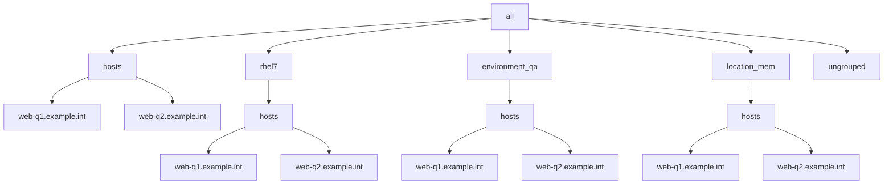

Using multiple Ansible YAML-based Inventories  
===

The following sections will explore use cases when using multiple YAML-based inventory files:

* [Example 1: Playbook using 2 YAML inventories with overlapping parent groups](#Example-01)

* [Example 2: Playbook using 2 YAML inventories with non-overlapping parent groups](#Example-02)

The purpose here is to fully understand how to leverage child group vars especially with respect to deriving the expected behavior for variable merging. 

The ansible environment used to perform the examples:

```output
$ git clone https://github.com/lj020326/ansible-inventory-file-examples.git
$ cd ansible-inventory-file-examples
$ git switch develop-lj
$ cd tests/ansible-group-priority
$ ansible --version
ansible [core 2.12.3]
  config file = None
  configured module search path = ['/Users/ljohnson/.ansible/plugins/modules', '/usr/share/ansible/plugins/modules']
  ansible python module location = /Users/ljohnson/.pyenv/versions/3.10.2/lib/python3.10/site-packages/ansible
  ansible collection location = /Users/ljohnson/.ansible/collections:/usr/share/ansible/collections
  executable location = /Users/ljohnson/.pyenv/versions/3.10.2/bin/ansible
  python version = 3.10.2 (main, Feb 21 2022, 15:35:10) [Clang 13.0.0 (clang-1300.0.29.30)]
  jinja version = 3.1.0
  libyaml = True
```


## <a id="Example-06"></a>Example 6: Using group_by key groups with ansible_group_priority

Copy the files used in the prior example for example 6.

Then modify the playbook to set the group_by key to 'cluster' for all hosts as follows:

```yaml
- name: "Run play"
  hosts: all
  gather_facts: false
  connection: local
  tasks:
    - name: Group hosts into 'cluster' group under 'override'
      group_by:
        key: "cluster"
        parents: "override"
    - debug: var=test
```


In this example, the following group/host hierarchy will be implemented in yaml as follows:



For this example we will use the same YAML inventory file representing machines at 2 different sites/locaitons.

The corresponding YAML inventory implementing the hierarchy is in the [example1 directory](./example1):

```yaml
all:
  children:
    hosts:
      web-q1.example.int:
        trace_var: hosts-site1/web-q1.example.int
        foreman: <94 keys>
        facts: {}
      web-q2.example.int:
        trace_var: hosts-site1/rhel7/web-q2.example.int
        foreman: <94 keys>
        facts: {}
    rhel7:
      vars:
        trace_var: hosts-site1/rhel7
      hosts:
        web-q1.example.int: {}
        web-q2.example.int: {}
    environment_qa:
      vars:
        trace_var: hosts-site1/environment_qa
      hosts:
        web-q1.example.int: {}
        web-q2.example.int: {}
    location_mem:
      vars:
        trace_var: hosts-site1/location_mem
      hosts:
        web-q1.example.int: {}
        web-q2.example.int: {}
    ungrouped: {}

```


Confirm that the new value 'cluster' should now appear for the variable 'test' for both hosts.

```output
ansible-playbook -i ./example6/hosts.ini ./example6/playbook.yml 

PLAY [Run play] **********************************************************************************************************************************************************************************************************************************************************

TASK [Group hosts into 'cluster' group under 'override'] *****************************************************************************************************************************************************************************************************************
ok: [host1]
changed: [host2]

TASK [debug] *************************************************************************************************************************************************************************************************************************************************************
ok: [host1] => {
    "test": "cluster"
}
ok: [host2] => {
    "test": "cluster"
}

PLAY RECAP ***************************************************************************************************************************************************************************************************************************************************************
host1                      : ok=2    changed=0    unreachable=0    failed=0    skipped=0    rescued=0    ignored=0   
host2                      : ok=2    changed=1    unreachable=0    failed=0    skipped=0    rescued=0    ignored=0   
```

Confirm that the results are as expected for the yaml inventory:

```output
ansible-playbook -i ./example6/hosts.yml ./example6/playbook.yml 

PLAY [Run play] **********************************************************************************************************************************************************************************************************************************************************

TASK [Group hosts into 'cluster' group under 'override'] *****************************************************************************************************************************************************************************************************************
ok: [host1]
changed: [host2]

TASK [debug] *************************************************************************************************************************************************************************************************************************************************************
ok: [host1] => {
    "test": "cluster"
}
ok: [host2] => {
    "test": "product2"
}

PLAY RECAP ***************************************************************************************************************************************************************************************************************************************************************
host1                      : ok=2    changed=0    unreachable=0    failed=0    skipped=0    rescued=0    ignored=0   
host2                      : ok=2    changed=1    unreachable=0    failed=0    skipped=0    rescued=0    ignored=0   
```

While the INI inventory is as expected, the YAML inventory does not result as expected since the host2 did not appear with the 'test' variable set to 'cluster'.
