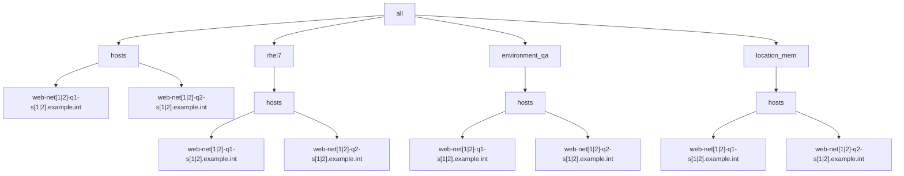

# Example 1: Playbook using 2 YAML inventories with overlapping parent groups  

The playbook as follows:

```yaml
- name: "Run trace var play"
  hosts: all
  gather_facts: false
  connection: local
  tasks:
    - debug:
        var: trace_var
```

In this example there are 2 networks located at 2 sites resulting in 4 YAML inventory files, with hierarchy diagrammed as follows:

```mermaid
graph TD;
    A[all] --> B[network1]
    A[all] --> C[network2]
    B --> D[site1 (located in network1/]
    B --> E[site2]
    C --> F[site1]
    C --> G[site2]
```


For each of the 4 inventory files, the following group/host hierarchy will be implemented:



The [network1 site1.yml inventory](./network1/site1.yml) follows:

```yaml
all:
  hosts:
    web-net1-q1-s1.example.int:
      trace_var: hosts-site1/web-net1-q1-s1.example.int
      foreman: <94 keys>
      facts: {}
    web-net1-q2-s1.example.int:
      trace_var: hosts-site1/rhel7/web-net1-q2-s1.example.int
      foreman: <94 keys>
      facts: {}
  children:
    rhel7:
      vars:
        trace_var: hosts-site1/rhel7
      hosts:
        web-net1-q1-s1.example.int: {}
        web-net1-q2-s1.example.int: {}
    environment_qa:
      vars:
        trace_var: hosts-site1/environment_qa
      hosts:
        web-net1-q1-s1.example.int: {}
        web-net1-q2-s1.example.int: {}
    location_site1:
      vars:
        trace_var: hosts-site1/location_site1
      hosts:
        web-net1-q1-s1.example.int: {}
        web-net1-q2-s1.example.int: {}
    ungrouped: {}

```

For the [network2 site1.yml inventory](./network2/site1.yml):

```yaml
all:
  hosts:
    web-net2-q1-s1.example.int:
      trace_var: hosts-site2/web-net2-q1-s1.example.int
      foreman: <94 keys>
      facts: {}
    web-net2-q2-s1.example.int:
      trace_var: hosts-site2/rhel7/web-net2-q2-s1.example.int
      foreman: <94 keys>
      facts: {}
  children:
    rhel7:
      vars:
        trace_var: hosts-site2/rhel7
      hosts:
        web-net2-q1-s1.example.int: {}
        web-net2-q2-s1.example.int: {}
    environment_qa:
      vars:
        trace_var: hosts-site2/environment_qa
      hosts:
        web-net2-q1-s1.example.int: {}
        web-net2-q2-s1.example.int: {}
    location_site2:
      vars:
        trace_var: hosts-site2/location_site2
      hosts:
        web-net2-q1-s1.example.int: {}
        web-net2-q2-s1.example.int: {}
    ungrouped: {}

```

With the 4 inventories, mentioned, we now seek to confirm that the expected value appears for the 'trace_var' variable for both hosts.

```output
ansible-playbook -i ./network1/site1.yml playbook.yml

PLAY [Run play] **********************************************************************************************************************************************************************************************************************************************************

TASK [Group hosts into 'cluster' group under 'override'] *****************************************************************************************************************************************************************************************************************
ok: [host1]
changed: [host2]

TASK [debug] *************************************************************************************************************************************************************************************************************************************************************
ok: [host1] => {
    "test": "cluster"
}
ok: [host2] => {
    "test": "cluster"
}

PLAY RECAP ***************************************************************************************************************************************************************************************************************************************************************
host1                      : ok=2    changed=0    unreachable=0    failed=0    skipped=0    rescued=0    ignored=0   
host2                      : ok=2    changed=1    unreachable=0    failed=0    skipped=0    rescued=0    ignored=0   
```

Confirm that the results are as expected for the yaml inventory:

```output
ansible-playbook -i ./example6/hosts.yml ./example6/playbook.yml 

PLAY [Run play] **********************************************************************************************************************************************************************************************************************************************************

TASK [Group hosts into 'cluster' group under 'override'] *****************************************************************************************************************************************************************************************************************
ok: [host1]
changed: [host2]

TASK [debug] *************************************************************************************************************************************************************************************************************************************************************
ok: [host1] => {
    "test": "cluster"
}
ok: [host2] => {
    "test": "product2"
}

PLAY RECAP ***************************************************************************************************************************************************************************************************************************************************************
host1                      : ok=2    changed=0    unreachable=0    failed=0    skipped=0    rescued=0    ignored=0   
host2                      : ok=2    changed=1    unreachable=0    failed=0    skipped=0    rescued=0    ignored=0   
```

While the INI inventory is as expected, the YAML inventory does not result as expected since the host2 did not appear with the 'test' variable set to 'cluster'.
