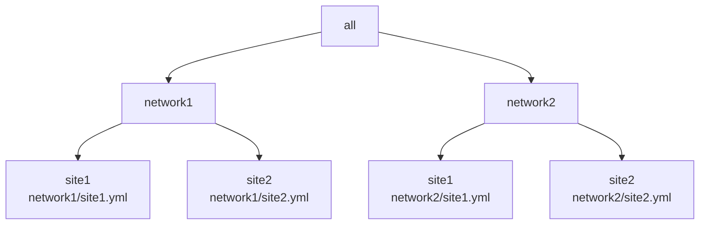
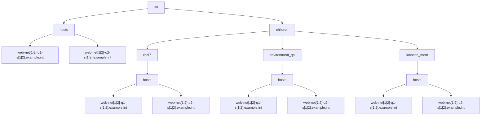

# Example 1: Playbook using 2 YAML inventories with overlapping parent groups  

The playbook as follows:

```yaml
- name: "Run trace var play"
  hosts: all
  gather_facts: false
  connection: local
  tasks:
    - debug:
        var: trace_var
```

In this example there are 2 networks located at 2 sites resulting in 4 YAML inventory files, with hierarchy diagrammed as follows:




For each of the 4 inventory files, the following group/host hierarchy will be implemented:



```yaml
- hosts: all
  gather_facts: no
  tasks:
    - fail:
        msg: 'Use --limit, Luke!'
      when: ansible_limit is not defined
```


Each site.yml inventory will be setup similar to the following with the "[1|2]" regex pattern evaluated for each of the 4 cases:

```yaml
all:
  hosts:
    web-net[1|2]-q1-s[1|2].example.int:
      trace_var: hosts-site[1|2]/web-net[1|2]-q1-s[1|2].example.int
      foreman: <94 keys>
      facts: {}
    web-net[1|2]-q2-s[1|2].example.int:
      trace_var: hosts-site[1|2]/rhel7/web-net[1|2]-q2-s[1|2].example.int
      foreman: <94 keys>
      facts: {}
  children:
    rhel7:
      vars:
        trace_var: hosts-site[1|2]/rhel7
      hosts:
        web-net[1|2]-q1-s[1|2].example.int: {}
        web-net[1|2]-q2-s[1|2].example.int: {}
    environment_qa:
      vars:
        trace_var: hosts-site[1|2]/environment_qa
      hosts:
        web-net[1|2]-q1-s[1|2].example.int: {}
        web-net[1|2]-q2-s[1|2].example.int: {}
    location_site1:
      vars:
        trace_var: hosts-site[1|2]/location_site1
      hosts:
        web-net[1|2]-q1-s[1|2].example.int: {}
        web-net[1|2]-q2-s[1|2].example.int: {}
    ungrouped: {}

```

Each of the respective inventory files:

* [network1/site1 inventory](./network1/site1.yml)
* [network1/site2 inventory](./network1/site2.yml)
* [network2/site1 inventory](./network2/site1.yml)
* [network2/site2 inventory](./network2/site2.yml)


With the 4 inventories, mentioned, we now seek to confirm that the expected value appears for the 'trace_var' variable for both hosts.

```output
ansible-playbook -i ./network1/site1.yml playbook.yml

PLAY [Run trace var play] ************************************************************************************************************************************************************************************************************************************************

TASK [debug] *************************************************************************************************************************************************************************************************************************************************************
ok: [web-q1-net1-s1.example.int] => {
    "trace_var": "network1/hosts-site1/web-q1-net1-s1.example.int"
}
ok: [web-q2-net1-s2.example.int] => {
    "trace_var": "network1/hosts-site1/rhel7/web-q2-net1-s2.example.int"
}

PLAY RECAP ***************************************************************************************************************************************************************************************************************************************************************
web-q1-net1-s1.example.int : ok=1    changed=0    unreachable=0    failed=0    skipped=0    rescued=0    ignored=0   
web-q2-net1-s2.example.int : ok=1    changed=0    unreachable=0    failed=0    skipped=0    rescued=0    ignored=0   

```

Confirm that the results are as expected for the yaml inventory:

```output
ansible-playbook -i ./example6/hosts.yml ./example6/playbook.yml 

PLAY [Run play] **********************************************************************************************************************************************************************************************************************************************************

TASK [Group hosts into 'cluster' group under 'override'] *****************************************************************************************************************************************************************************************************************
ok: [host1]
changed: [host2]

TASK [debug] *************************************************************************************************************************************************************************************************************************************************************
ok: [host1] => {
    "test": "cluster"
}
ok: [host2] => {
    "test": "product2"
}

PLAY RECAP ***************************************************************************************************************************************************************************************************************************************************************
host1                      : ok=2    changed=0    unreachable=0    failed=0    skipped=0    rescued=0    ignored=0   
host2                      : ok=2    changed=1    unreachable=0    failed=0    skipped=0    rescued=0    ignored=0   
```

While the INI inventory is as expected, the YAML inventory does not result as expected since the host2 did not appear with the 'test' variable set to 'cluster'.
