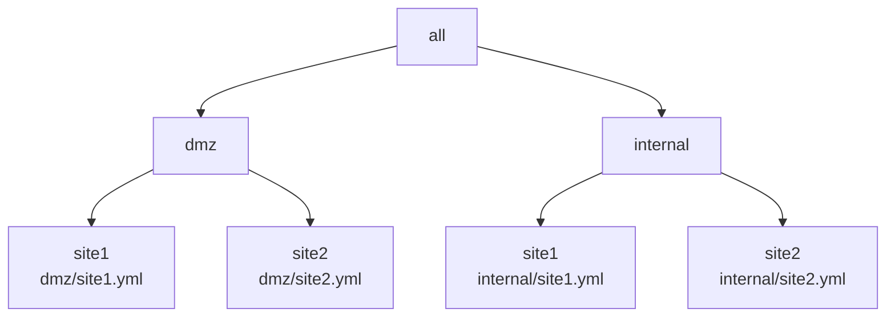
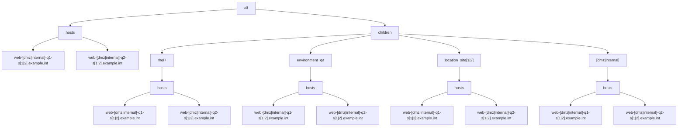

# Example 4: Multiple YAML inventories with role based groups

In the prior [Example 3](../example3/README.md), we found the method to merge multiple YAML inventories with the merged results observing intended or expected behavior.

Now we will look to apply plays that can target machines in the merged inventory based on the role-based group desired.

E.g., the following scenario will discuss a simple NTP client/server based playbook to apply across the merged inventory. 

## Playbook used

To begin, we will start with the same playbook from the prior examples as follows:

```yaml
- name: "Run trace var play"
  hosts: all
  gather_facts: false
  connection: local
  tasks:
    - debug:
        var: trace_var
    - debug:
        var: group_names
```

In this example there are 2 networks located at 2 sites resulting in 4 YAML inventory files, with hierarchy diagrammed as follows:




For each of the 4 inventory files, the following group/host hierarchy will be implemented:




Each site.yml inventory will be setup similar to the following with the "[dmz|internal]" and "[1|2]" regex patterns evaluated for each of the 4 cases:

```yaml
all:
  hosts:
    admin-[dmz|internal]-q1-s[1|2].example.int: 
      trace_var: site[1|2]/admin-[dmz|internal]-q1-s[1|2].example.int
      foreman: <94 keys>
    admin-[dmz|internal]-q2-s[1|2].example.int: 
      trace_var: site[1|2]/admin-[dmz|internal]-q1-s[1|2].example.int
      foreman: <94 keys>
    app-[dmz|internal]-q1-s[1|2].example.int: 
      trace_var: site[1|2]/app-[dmz|internal]-q1-s[1|2].example.int
      foreman: <94 keys>
    app-[dmz|internal]-q2-s[1|2].example.int: 
      trace_var: site[1|2]/app-[dmz|internal]-q1-s[1|2].example.int
      foreman: <94 keys>
    web-[dmz|internal]-q1-s[1|2].example.int:
      trace_var: site[1|2]/web-[dmz|internal]-q1-s[1|2].example.int
      foreman: <94 keys>
    web-[dmz|internal]-q2-s[1|2].example.int:
      trace_var: site[1|2]/rhel7/web-[dmz|internal]-q2-s[1|2].example.int
      foreman: <94 keys>
  children:
    rhel6:
      vars:
        trace_var: dmz/site1/rhel6
      hosts:
        admin-[dmz|internal]-q1-s[1|2].example.int: {}
    rhel7:
      vars:
        trace_var: site[1|2]/rhel7
      hosts:
        admin-[dmz|internal]-q2-s[1|2].example.int: {}
        app-[dmz|internal]-q1-s[1|2].example.int: {}
        app-[dmz|internal]-q2-s[1|2].example.int: {}
        web-[dmz|internal]-q1-s[1|2].example.int: {}
        web-[dmz|internal]-q2-s[1|2].example.int: {}
    environment_qa:
      vars:
        trace_var: site[1|2]/environment_qa
      hosts:
        admin-[dmz|internal]-q1-s[1|2].example.int: {}
        admin-[dmz|internal]-q1-s[1|2].example.int: {}
        app-[dmz|internal]-q1-s[1|2].example.int: {}
        app-[dmz|internal]-q2-s[1|2].example.int: {}
        web-[dmz|internal]-q1-s[1|2].example.int: {}
        web-[dmz|internal]-q2-s[1|2].example.int: {}
    location_site[1|2]:
      vars:
        trace_var: site[1|2]/location_site[1|2]
      hosts:
        admin-[dmz|internal]-q1-s[1|2].example.int: {}
        admin-[dmz|internal]-q1-s[1|2].example.int: {}
        app-[dmz|internal]-q1-s[1|2].example.int: {}
        app-[dmz|internal]-q2-s[1|2].example.int: {}
        web-[dmz|internal]-q1-s[1|2].example.int: {}
        web-[dmz|internal]-q2-s[1|2].example.int: {}
    [dmz|internal]:
      vars:
        trace_var: site[1|2]/[dmz|internal]
      hosts:
        admin-[dmz|internal]-q1-s[1|2].example.int: {}
        admin-[dmz|internal]-q1-s[1|2].example.int: {}
        app-[dmz|internal]-q1-s[1|2].example.int: {}
        app-[dmz|internal]-q2-s[1|2].example.int: {}
        web-[dmz|internal]-q1-s[1|2].example.int: {}
        web-[dmz|internal]-q2-s[1|2].example.int: {}
    ungrouped: {}

```

Each of the respective inventory files:

* [dmz/site1 inventory](./inventory/dmz/site1.yml)
* [dmz/site2 inventory](./inventory/dmz/site2.yml)
* [internal/site1 inventory](./inventory/internal/site1.yml)
* [internal/site2 inventory](./inventory/internal/site2.yml)


## Define NTP inventory groups

For the ntp playbook/role to work on both servers and clients, we will define the 'ntp_server' and 'ntp_client' groups to correctly scope the machines to be applied.

For each network/site, there will be 2 __ntp servers__ resulting in a total of 8 hosts to be targeted for the 'ntp-server' play/role application.

Specifically, the 'ntp_server' group configuration will be applied to the following 8 'admin' machines (2 host instances for each specific network/site):

```output
admin-dmz-q1-s1.example.int
admin-dmz-q2-s1.example.int
admin-dmz-q1-s2.example.int
admin-dmz-q2-s2.example.int
admin-internal-q1-s1.example.int
admin-internal-q2-s1.example.int
admin-internal-q1-s2.example.int
admin-internal-q2-s2.example.int
```


The 'ntp-client' group will include all linux machines for the respective environment.
In this case, the environment will be defined with the existing test environment group named 'environment_test'.

Now, we can define the YAML groups to be used by the 'ntp' playbook/role as follows:

[inventory/dmz/ntp.yml](./inventory/dmz/ntp.yml):
```yaml
all:
  children:
    ntp_server:
      hosts:
        admin-q1-dmz-s1.example.int: {}
        admin-q2-dmz-s1.example.int: {}
        admin-q1-dmz-s2.example.int: {}
        admin-q2-dmz-s2.example.int: {}
    ntp_client:
      children:
        environment_test: {}
```

[inventory/internal/ntp.yml](./inventory/internal/ntp.yml):
```yaml
all:
  children:
    ntp_server:
      hosts:
        admin-q1-internal-s1.example.int: {}
        admin-q2-internal-s1.example.int: {}
        admin-q1-internal-s2.example.int: {}
        admin-q2-internal-s2.example.int: {}
    ntp_client:
      children:
        environment_test: {}
```

To keep things simple by re-using existing groups, the 'ntp_client' group is defined using the children group of 'environment_test'.  Note that the 'ntp_client' group includes the 8 admin machines already included in the 'ntp_server' group.  This overlap can be worked around by making sure that the 'ntp_server' group is excluded for the respective plays that only mean to target the 'ntp_client' machines.  This will be demonstrated in the following verifications section. 

We will now run through several ansible CLI tests to verify that the correct machines result for each respective limit used.

### Run 1: Target all ntp servers

```shell
ansible -i ./inventory/ ntp_server  -m debug -a var=trace_var,group_names
admin-q1-dmz-s1.example.int | SUCCESS => {
    "trace_var,group_names": "('dmz/site1/admin-q1-dmz-s1.example.int', ['dmz', 'environment_test', 'location_site1', 'ntp_client', 'ntp_server', 'rhel6'])"
}
admin-q2-dmz-s1.example.int | SUCCESS => {
    "trace_var,group_names": "('dmz/site1/admin-q2-dmz-s1.example.int', ['dmz', 'environment_test', 'location_site1', 'ntp_client', 'ntp_server', 'rhel7'])"
}
admin-q1-dmz-s2.example.int | SUCCESS => {
    "trace_var,group_names": "('dmz/site2/admin-q1-dmz-s2.example.int', ['dmz', 'environment_test', 'location_site2', 'ntp_client', 'ntp_server', 'rhel6'])"
}
admin-q2-dmz-s2.example.int | SUCCESS => {
    "trace_var,group_names": "('dmz/site2/admin-q2-dmz-s2.example.int', ['dmz', 'environment_test', 'location_site2', 'ntp_client', 'ntp_server', 'rhel7'])"
}
admin-q1-internal-s1.example.int | SUCCESS => {
    "trace_var,group_names": "('internal/site1/admin-q1-internal-s1.example.int', ['environment_test', 'internal', 'location_site1', 'ntp_client', 'ntp_server', 'rhel6'])"
}
admin-q2-internal-s1.example.int | SUCCESS => {
    "trace_var,group_names": "('internal/site1/admin-q2-internal-s1.example.int', ['environment_test', 'internal', 'location_site1', 'ntp_client', 'ntp_server', 'rhel7'])"
}
admin-q1-internal-s2.example.int | SUCCESS => {
    "trace_var,group_names": "('internal/site2/admin-q1-internal-s2.example.int', ['environment_test', 'internal', 'location_site2', 'ntp_client', 'ntp_server', 'rhel6'])"
}
admin-q2-internal-s2.example.int | SUCCESS => {
    "trace_var,group_names": "('internal/site2/admin-q2-internal-s2.example.int', ['environment_test', 'internal', 'location_site2', 'ntp_client', 'ntp_server', 'rhel7'])"
}

```

This is as expected.


### Run 1: Target all ntp clients

In this case, note to keep things simple by re-using existing groups, that the 'ntp_clients' group is defined using the children group of 'environment_test'

```shell
ansible -i ./inventory/ ntp_client,\!ntp_server  -m debug -a var=trace_var,group_names
app-q1-dmz-s1.example.int | SUCCESS => {
    "trace_var,group_names": "('dmz/site1/app-q1-dmz-s1.example.int', ['dmz', 'environment_test', 'location_site1', 'ntp_client', 'rhel7'])"
}
app-q2-dmz-s1.example.int | SUCCESS => {
    "trace_var,group_names": "('dmz/site1/app-q2-dmz-s1.example.int', ['dmz', 'environment_test', 'location_site1', 'ntp_client', 'rhel7'])"
}
web-q1-dmz-s1.example.int | SUCCESS => {
    "trace_var,group_names": "('dmz/site1/web-q1-dmz-s1.example.int', ['dmz', 'environment_test', 'location_site1', 'ntp_client', 'rhel7'])"
}
web-q2-dmz-s1.example.int | SUCCESS => {
    "trace_var,group_names": "('dmz/site1/web-q2-dmz-s1.example.int', ['dmz', 'environment_test', 'location_site1', 'ntp_client', 'rhel7'])"
}
app-q1-dmz-s2.example.int | SUCCESS => {
    "trace_var,group_names": "('dmz/site2/app-q1-dmz-s2.example.int', ['dmz', 'environment_test', 'location_site2', 'ntp_client', 'rhel7'])"
}
app-q2-dmz-s2.example.int | SUCCESS => {
    "trace_var,group_names": "('dmz/site2/app-q2-dmz-s2.example.int', ['dmz', 'environment_test', 'location_site2', 'ntp_client', 'rhel7'])"
}
web-q1-dmz-s2.example.int | SUCCESS => {
    "trace_var,group_names": "('dmz/site2/web-q1-dmz-s2.example.int', ['dmz', 'environment_test', 'location_site2', 'ntp_client', 'rhel7'])"
}
web-q2-dmz-s2.example.int | SUCCESS => {
    "trace_var,group_names": "('dmz/site2/web-q2-dmz-s2.example.int', ['dmz', 'environment_test', 'location_site2', 'ntp_client', 'rhel7'])"
}
app-q1-internal-s1.example.int | SUCCESS => {
    "trace_var,group_names": "('internal/site1/app-q1-internal-s1.example.int', ['environment_test', 'internal', 'location_site1', 'ntp_client', 'rhel7'])"
}
app-q2-internal-s1.example.int | SUCCESS => {
    "trace_var,group_names": "('internal/site1/app-q2-internal-s1.example.int', ['environment_test', 'internal', 'location_site1', 'ntp_client', 'rhel7'])"
}
web-q1-internal-s1.example.int | SUCCESS => {
    "trace_var,group_names": "('internal/site1/web-q1-internal-s1.example.int', ['environment_test', 'internal', 'location_site1', 'ntp_client', 'rhel7'])"
}
web-q2-internal-s1.example.int | SUCCESS => {
    "trace_var,group_names": "('internal/site1/web-q2-internal-s1.example.int', ['environment_test', 'internal', 'location_site1', 'ntp_client', 'rhel7'])"
}
app-q1-internal-s2.example.int | SUCCESS => {
    "trace_var,group_names": "('internal/site2/app-q1-internal-s2.example.int', ['environment_test', 'internal', 'location_site2', 'ntp_client', 'rhel7'])"
}
app-q2-internal-s2.example.int | SUCCESS => {
    "trace_var,group_names": "('internal/site2/app-q2-internal-s2.example.int', ['environment_test', 'internal', 'location_site2', 'ntp_client', 'rhel7'])"
}
web-q1-internal-s2.example.int | SUCCESS => {
    "trace_var,group_names": "('internal/site2/web-q1-internal-s2.example.int', ['environment_test', 'internal', 'location_site2', 'ntp_client', 'rhel7'])"
}
web-q2-internal-s2.example.int | SUCCESS => {
    "trace_var,group_names": "('internal/site2/web-q2-internal-s2.example.int', ['environment_test', 'internal', 'location_site2', 'ntp_client', 'rhel7'])"
}

```


## NTP Playbook


## Debug host vars using groups to target sets of hosts

Run debug using a group defined set of hosts.

Run for group 'internal'
```shell
ansible -i ./inventory/ internal -m debug -a var=trace_var 
web-q1-internal-s1.example.int | SUCCESS => {
    "trace_var": "internal/site1/web-q1-internal-s1.example.int"
}
web-q2-internal-s1.example.int | SUCCESS => {
    "trace_var": "internal/site1/web-q2-internal-s1.example.int"
}
web-q1-internal-s2.example.int | SUCCESS => {
    "trace_var": "internal/site2/web-q1-internal-s2.example.int"
}
web-q2-internal-s2.example.int | SUCCESS => {
    "trace_var": "internal/site2/web-q2-internal-s2.example.int"
}

```

Run for group 'location_site1'
```shell
ansible -i ./inventory/ -m debug -a var=trace_var location_site1
web-q1-dmz-s1.example.int | SUCCESS => {
    "trace_var": "dmz/site1/web-q1-dmz-s1.example.int"
}
web-q2-dmz-s1.example.int | SUCCESS => {
    "trace_var": "dmz/site1/web-q2-dmz-s1.example.int"
}
web-q1-internal-s1.example.int | SUCCESS => {
    "trace_var": "internal/site1/web-q1-internal-s1.example.int"
}
web-q2-internal-s1.example.int | SUCCESS => {
    "trace_var": "internal/site1/web-q2-internal-s1.example.int"
}

```

Run for group(s) matching expression '*site1'
```shell
ansible -i ./inventory/ -m debug -a var=trace_var *site1
web-q1-dmz-s1.example.int | SUCCESS => {
    "trace_var": "dmz/site1/web-q1-dmz-s1.example.int"
}
web-q2-dmz-s1.example.int | SUCCESS => {
    "trace_var": "dmz/site1/web-q2-dmz-s1.example.int"
}
web-q1-internal-s1.example.int | SUCCESS => {
    "trace_var": "internal/site1/web-q1-internal-s1.example.int"
}
web-q2-internal-s1.example.int | SUCCESS => {
    "trace_var": "internal/site1/web-q2-internal-s1.example.int"
}

```

Run for group(s) matching multiple groups 'location_site1,&dmz'
```shell
ansible -i ./inventory/ -m debug -a var=trace_var location_site1,\&dmz
web-q1-dmz-s1.example.int | SUCCESS => {
    "trace_var": "dmz/site1/web-q1-dmz-s1.example.int"
}
web-q2-dmz-s1.example.int | SUCCESS => {
    "trace_var": "dmz/site1/web-q2-dmz-s1.example.int"
}

```


## Limit hosts in a group

Run for group 'site1' with a specified limit
```shell
ansible -i ./inventory/ -m debug -a var=trace_var location_site1 -l web-q2*
web-q2-dmz-s1.example.int | SUCCESS => {
    "trace_var": "dmz/site1/web-q2-dmz-s1.example.int"
}
web-q2-internal-s1.example.int | SUCCESS => {
    "trace_var": "internal/site1/web-q2-internal-s1.example.int"
}

```

```shell
ansible -i ./inventory/ -m debug -a var=foreman.capabilities location_site1 -l web-q1*
web-q1-dmz-s1.example.int | SUCCESS => {
    "foreman.capabilities": [
        "build"
    ]
}
web-q1-internal-s1.example.int | SUCCESS => {
    "foreman.capabilities": [
        "build"
    ]
}

```

```shell
ansible -i ./inventory/ internal -l web-q1* -m debug -a var=foreman.content_facet_attributes.lifecycle_environment.name
web-q1-internal-s1.example.int | SUCCESS => {
    "foreman.content_facet_attributes.lifecycle_environment.name": "QA"
}
web-q1-internal-s2.example.int | SUCCESS => {
    "foreman.content_facet_attributes.lifecycle_environment.name": "QA"
}

```


```shell
ansible -i ./inventory/ internal -l web-q1* -m debug -a var=foreman.content_facet_attributes.lifecycle_environment
web-q1-internal-s1.example.int | SUCCESS => {
    "foreman.content_facet_attributes.lifecycle_environment": {
        "id": 3,
        "name": "QA"
    }
}
web-q1-internal-s2.example.int | SUCCESS => {
    "foreman.content_facet_attributes.lifecycle_environment": {
        "id": 3,
        "name": "QA"
    }
}

```

```shell
ansible -i ./inventory/ dmz  -m debug -a var=trace_var,foreman.content_facet_attributes.lifecycle_environment.name,foreman.location_name
admin-q1-dmz-s1.example.int | SUCCESS => {
    "trace_var,foreman.content_facet_attributes.lifecycle_environment.name,foreman.location_name": "('dmz/site1/admin-q1-dmz-s1.example.int', 'DEV', 'SITE1')"
}
admin-q2-dmz-s1.example.int | SUCCESS => {
    "trace_var,foreman.content_facet_attributes.lifecycle_environment.name,foreman.location_name": "('dmz/site1/admin-q2-dmz-s1.example.int', 'DEV', 'SITE1')"
}
app-q1-dmz-s1.example.int | SUCCESS => {
    "trace_var,foreman.content_facet_attributes.lifecycle_environment.name,foreman.location_name": "('dmz/site1/app-q1-dmz-s1.example.int', 'QA', 'SITE1')"
}
app-q2-dmz-s1.example.int | SUCCESS => {
    "trace_var,foreman.content_facet_attributes.lifecycle_environment.name,foreman.location_name": "('dmz/site1/app-q2-dmz-s1.example.int', 'QA', 'SITE1')"
}
web-q1-dmz-s1.example.int | SUCCESS => {
    "trace_var,foreman.content_facet_attributes.lifecycle_environment.name,foreman.location_name": "('dmz/site1/web-q1-dmz-s1.example.int', 'QA', 'SITE1')"
}
web-q2-dmz-s1.example.int | SUCCESS => {
    "trace_var,foreman.content_facet_attributes.lifecycle_environment.name,foreman.location_name": "('dmz/site1/web-q2-dmz-s1.example.int', 'QA', 'SITE1')"
}
admin-q1-dmz-s2.example.int | SUCCESS => {
    "trace_var,foreman.content_facet_attributes.lifecycle_environment.name,foreman.location_name": "('dmz/site2/admin-q1-dmz-s2.example.int', 'DEV', 'SITE2')"
}
admin-q2-dmz-s2.example.int | SUCCESS => {
    "trace_var,foreman.content_facet_attributes.lifecycle_environment.name,foreman.location_name": "('dmz/site2/admin-q2-dmz-s2.example.int', 'DEV', 'SITE2')"
}
app-q1-dmz-s2.example.int | SUCCESS => {
    "trace_var,foreman.content_facet_attributes.lifecycle_environment.name,foreman.location_name": "('dmz/site2/app-q1-dmz-s2.example.int', 'QA', 'SITE2')"
}
app-q2-dmz-s2.example.int | SUCCESS => {
    "trace_var,foreman.content_facet_attributes.lifecycle_environment.name,foreman.location_name": "('dmz/site2/app-q2-dmz-s2.example.int', 'QA', 'SITE2')"
}
web-q1-dmz-s2.example.int | SUCCESS => {
    "trace_var,foreman.content_facet_attributes.lifecycle_environment.name,foreman.location_name": "('dmz/site2/web-q1-dmz-s2.example.int', 'QA', 'SITE2')"
}
web-q2-dmz-s2.example.int | SUCCESS => {
    "trace_var,foreman.content_facet_attributes.lifecycle_environment.name,foreman.location_name": "('dmz/site2/web-q2-dmz-s2.example.int', 'QA', 'SITE2')"
}

```

```shell
ansible -i ./inventory/ -m debug -a var=foreman.content_facet_attributes internal -l web-q1*
web-q1-internal-s1.example.int | SUCCESS => {
    "foreman.content_facet_attributes": {
        "applicable_module_stream_count": 0,
        "applicable_package_count": 7,
        "content_source": null,
        "content_source_id": null,
        "content_source_name": null,
        "content_view": {
            "id": 8,
            "name": "RHEL7_composite"
        },
        "content_view_id": 8,
        "content_view_name": "RHEL7_composite",
        "errata_counts": {
            "bugfix": 0,
            "enhancement": 0,
            "security": 0,
            "total": 0
        },
        "id": 105,
        "kickstart_repository": null,
        "kickstart_repository_id": null,
        "kickstart_repository_name": null,
        "lifecycle_environment": {
            "id": 3,
            "name": "QA"
        },
        "lifecycle_environment_id": 3,
        "lifecycle_environment_name": "QA",
        "upgradable_module_stream_count": 0,
        "upgradable_package_count": 0,
        "uuid": "7a1cb585-1265-4232-baf1-eee16f2cf819"
    }
}
web-q1-internal-s2.example.int | SUCCESS => {
    "foreman.content_facet_attributes": {
        "applicable_module_stream_count": 0,
        "applicable_package_count": 7,
        "content_source": null,
        "content_source_id": null,
        "content_source_name": null,
        "content_view": {
            "id": 8,
            "name": "RHEL7_composite"
        },
        "content_view_id": 8,
        "content_view_name": "RHEL7_composite",
        "errata_counts": {
            "bugfix": 0,
            "enhancement": 0,
            "security": 0,
            "total": 0
        },
        "id": 105,
        "kickstart_repository": null,
        "kickstart_repository_id": null,
        "kickstart_repository_name": null,
        "lifecycle_environment": {
            "id": 3,
            "name": "QA"
        },
        "lifecycle_environment_id": 3,
        "lifecycle_environment_name": "QA",
        "upgradable_module_stream_count": 0,
        "upgradable_package_count": 0,
        "uuid": "7a1cb585-1265-4232-baf1-eee16f2cf819"
    }
}

```

