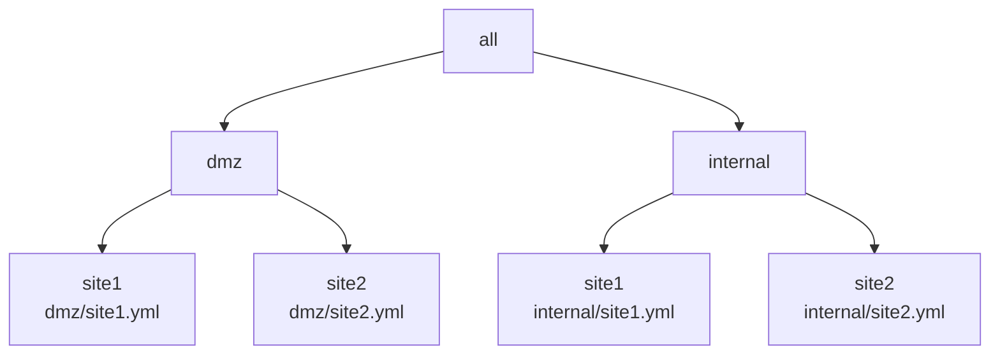
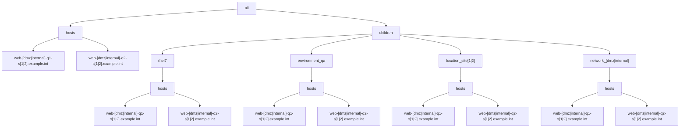

# Example 4: Multiple YAML inventories with 'role-based' INI inventory groups

In the prior [Example 3](../example3/README.md), we found the method to merge multiple YAML inventories with the merged results observing intended or expected behavior.

Now we will look to apply plays that can target machines in the merged inventory with 'role-based' inventory groups.

E.g., the following scenario will discuss a simple NTP client/server based playbook to apply across the merged inventory. 

## Overview

In this example there are 2 networks located at 2 sites resulting in 4 YAML inventory files, with hierarchy diagrammed as follows:




For each of the 4 inventory files, the following group/host hierarchy will be implemented:




Each site.yml inventory will be setup similar to the following with the "[dmz|internal]" and "[1|2]" regex patterns evaluated for each of the 4 cases:

```yaml
all:
  hosts:
    admin-[dmz|internal]-q1-s[1|2].example.int: 
      trace_var: site[1|2]/admin-[dmz|internal]-q1-s[1|2].example.int
      foreman: <94 keys>
    admin-[dmz|internal]-q2-s[1|2].example.int: 
      trace_var: site[1|2]/admin-[dmz|internal]-q1-s[1|2].example.int
      foreman: <94 keys>
    app-[dmz|internal]-q1-s[1|2].example.int: 
      trace_var: site[1|2]/app-[dmz|internal]-q1-s[1|2].example.int
      foreman: <94 keys>
    app-[dmz|internal]-q2-s[1|2].example.int: 
      trace_var: site[1|2]/app-[dmz|internal]-q1-s[1|2].example.int
      foreman: <94 keys>
    web-[dmz|internal]-q1-s[1|2].example.int:
      trace_var: site[1|2]/web-[dmz|internal]-q1-s[1|2].example.int
      foreman: <94 keys>
    web-[dmz|internal]-q2-s[1|2].example.int:
      trace_var: site[1|2]/rhel7/web-[dmz|internal]-q2-s[1|2].example.int
      foreman: <94 keys>
  children:
    rhel6:
      vars:
        trace_var: dmz/site1/rhel6
      hosts:
        admin-[dmz|internal]-q1-s[1|2].example.int: {}
    rhel7:
      vars:
        trace_var: site[1|2]/rhel7
      hosts:
        admin-[dmz|internal]-q2-s[1|2].example.int: {}
        app-[dmz|internal]-q1-s[1|2].example.int: {}
        app-[dmz|internal]-q2-s[1|2].example.int: {}
        web-[dmz|internal]-q1-s[1|2].example.int: {}
        web-[dmz|internal]-q2-s[1|2].example.int: {}
    environment_qa:
      vars:
        trace_var: site[1|2]/environment_qa
      hosts:
        admin-[dmz|internal]-q1-s[1|2].example.int: {}
        admin-[dmz|internal]-q1-s[1|2].example.int: {}
        app-[dmz|internal]-q1-s[1|2].example.int: {}
        app-[dmz|internal]-q2-s[1|2].example.int: {}
        web-[dmz|internal]-q1-s[1|2].example.int: {}
        web-[dmz|internal]-q2-s[1|2].example.int: {}
    location_site[1|2]:
      vars:
        trace_var: site[1|2]/location_site[1|2]
      hosts:
        admin-[dmz|internal]-q1-s[1|2].example.int: {}
        admin-[dmz|internal]-q1-s[1|2].example.int: {}
        app-[dmz|internal]-q1-s[1|2].example.int: {}
        app-[dmz|internal]-q2-s[1|2].example.int: {}
        web-[dmz|internal]-q1-s[1|2].example.int: {}
        web-[dmz|internal]-q2-s[1|2].example.int: {}
    network_[dmz|internal]:
      vars:
        trace_var: site[1|2]/network_[dmz|internal]
      hosts:
        admin-[dmz|internal]-q1-s[1|2].example.int: {}
        admin-[dmz|internal]-q1-s[1|2].example.int: {}
        app-[dmz|internal]-q1-s[1|2].example.int: {}
        app-[dmz|internal]-q2-s[1|2].example.int: {}
        web-[dmz|internal]-q1-s[1|2].example.int: {}
        web-[dmz|internal]-q2-s[1|2].example.int: {}
    ungrouped: {}

```

Each of the respective inventory files:

* [dmz/site1 inventory](./inventory/dmz/site1.yml)
* [dmz/site2 inventory](./inventory/dmz/site2.yml)
* [internal/site1 inventory](./inventory/internal/site1.yml)
* [internal/site2 inventory](./inventory/internal/site2.yml)


## Define NTP inventory groups

For the ntp playbook/role to work on both servers and clients, we will define the 'ntp_server' and 'ntp_client' groups to correctly scope the machines to be applied.

For each network/site, there will be 2 __ntp servers__ resulting in a total of 8 hosts to be targeted for the 'ntp-server' play/role application.

Specifically, the 'ntp_server' group configuration will be applied to the following 8 'admin' machines (2 host instances for each specific network/site):

```output
admin-dmz-q1-s1.example.int
admin-dmz-q2-s1.example.int
admin-dmz-q1-s2.example.int
admin-dmz-q2-s2.example.int
admin-internal-q1-s1.example.int
admin-internal-q2-s1.example.int
admin-internal-q1-s2.example.int
admin-internal-q2-s2.example.int
```


The 'ntp-client' group will include all linux machines for the respective environment.
In this case, the environment will be defined with the existing test environment group named 'environment_test'.

Now we can define the YAML groups to be used by the 'ntp' playbook/role as follows:

[inventory/dmz/ntp.yml](./inventory/dmz/ntp.ini):
```ini

[ntp_server]
admin-q1-dmz-s1.example.int
admin-q2-dmz-s1.example.int
admin-q1-dmz-s2.example.int
admin-q2-dmz-s2.example.int

[ntp_client:children]
environment_test


[location_site1:vars]
trace_var=dmz/ntp/location_site1
gateway_ipv4=112.112.0.1
gateway_ipv4_network_cidr=112.112.0.0/16

[location_site2:vars]
trace_var=dmz/ntp/location_site2
gateway_ipv4=221.221.0.1
gateway_ipv4_network_cidr=221.221.0.0/16
```

[inventory/internal/ntp.ini](./inventory/internal/ntp.ini):
```ini
[ntp_server]
admin-q1-internal-s1.example.int
admin-q2-internal-s1.example.int
admin-q1-internal-s2.example.int
admin-q2-internal-s2.example.int

[ntp_client:children]
environment_test

[ntp:children]
ntp_client
ntp_server

[location_site1:vars]
trace_var=internal/ntp/location_site1
gateway_ipv4=192.168.112.1
gateway_ipv4_network_cidr=192.168.112.0/16

[location_site2:vars]
trace_var=internal/ntp/location_site2
gateway_ipv4=192.168.221.1
gateway_ipv4_network_cidr=192.168.221.0/16
```

The 'ntp_client' group is defined with the children group of 'environment_test'.  

Note that the 'ntp_client' group includes the 8 admin machines already included in the 'ntp_server' group.  This overlap can be addressed by making sure that the 'ntp_server' group is excluded for the respective plays that only mean to target the 'ntp_client' machines.  This will be demonstrated in the following verifications section. 

We will now run through several ansible CLI tests to verify that the correct machines result for each respective limit used.

### Test 1: Show list of all ntp hosts

First we verify that the correct list of machines appear by running .
We run the first '--list-hosts' test with the following results.

```shell
ansible -i ./inventory --list-hosts ntp
[WARNING]: Could not match supplied host pattern, ignoring: ntp
[WARNING]: No hosts matched, nothing to do
  hosts (0):
```

This is not what we expect.

According to several known issues (TODO - cite issue link(s) here), the ini files must be renamed without the INI extension for ansible to properly pull in the respective files.

So rename the ntp.ini files to remove the ini extension from the file names.

We now re-run the first '--list-hosts' test with the following results.


```shell
ansible -i ./inventory --list-hosts ntp
  hosts (24):
    admin-q1-dmz-s1.example.int
    admin-q2-dmz-s1.example.int
    app-q1-dmz-s1.example.int
    app-q2-dmz-s1.example.int
    web-q1-dmz-s1.example.int
    web-q2-dmz-s1.example.int
    admin-q1-dmz-s2.example.int
    admin-q2-dmz-s2.example.int
    app-q1-dmz-s2.example.int
    app-q2-dmz-s2.example.int
    web-q1-dmz-s2.example.int
    web-q2-dmz-s2.example.int
    admin-q1-internal-s1.example.int
    admin-q2-internal-s1.example.int
    app-q1-internal-s1.example.int
    app-q2-internal-s1.example.int
    web-q1-internal-s1.example.int
    web-q2-internal-s1.example.int
    admin-q1-internal-s2.example.int
    admin-q2-internal-s2.example.int
    app-q1-internal-s2.example.int
    app-q2-internal-s2.example.int
    web-q1-internal-s2.example.int
    web-q2-internal-s2.example.int

```

### Test 2: Show debug for ntp servers

```shell
ansible -i ./inventory/dmz -m debug -a var=ntp_servers ntp
admin-q1-dmz-s1.example.int | SUCCESS => {
    "ntp_servers": [
        "0.us.pool.ntp.org iburst xleave",
        "1.us.pool.ntp.org iburst xleave",
        "2.us.pool.ntp.org iburst xleave",
        "3.us.pool.ntp.org iburst xleave"
    ]
}
admin-q2-dmz-s1.example.int | SUCCESS => {
    "ntp_servers": [
        "0.us.pool.ntp.org iburst xleave",
        "1.us.pool.ntp.org iburst xleave",
        "2.us.pool.ntp.org iburst xleave",
        "3.us.pool.ntp.org iburst xleave"
    ]
}
admin-q1-dmz-s2.example.int | SUCCESS => {
    "ntp_servers": [
        "0.us.pool.ntp.org iburst xleave",
        "1.us.pool.ntp.org iburst xleave",
        "2.us.pool.ntp.org iburst xleave",
        "3.us.pool.ntp.org iburst xleave"
    ]
}
admin-q2-dmz-s2.example.int | SUCCESS => {
    "ntp_servers": [
        "0.us.pool.ntp.org iburst xleave",
        "1.us.pool.ntp.org iburst xleave",
        "2.us.pool.ntp.org iburst xleave",
        "3.us.pool.ntp.org iburst xleave"
    ]
}
app-q2-dmz-s1.example.int | SUCCESS => {
    "ntp_servers": []
}
app-q1-dmz-s1.example.int | SUCCESS => {
    "ntp_servers": []
}
web-q1-dmz-s1.example.int | SUCCESS => {
    "ntp_servers": []
}
web-q2-dmz-s1.example.int | SUCCESS => {
    "ntp_servers": []
}
app-q1-dmz-s2.example.int | SUCCESS => {
    "ntp_servers": []
}
app-q2-dmz-s2.example.int | SUCCESS => {
    "ntp_servers": []
}
web-q1-dmz-s2.example.int | SUCCESS => {
    "ntp_servers": []
}
web-q2-dmz-s2.example.int | SUCCESS => {
    "ntp_servers": []
}

```

This is as expected.


### Test 2: Target all ntp clients

As mentioned earlier, the 'ntp_clients' group is defined using the children group of 'environment_test'.  The following ansible debug command excludes the 'ntp_server' hosts from that set such to target only the non-'ntp-server' hosts.

```shell
ansible -i ./inventory/ -m debug -a var=ntp_servers ntp_client,\!ntp_server
app-q1-dmz-s1.example.int | SUCCESS => {
    "ntp_servers": []
}
app-q2-dmz-s1.example.int | SUCCESS => {
    "ntp_servers": []
}
web-q1-dmz-s1.example.int | SUCCESS => {
    "ntp_servers": []
}
web-q2-dmz-s1.example.int | SUCCESS => {
    "ntp_servers": []
}
app-q1-dmz-s2.example.int | SUCCESS => {
    "ntp_servers": []
}
app-q2-dmz-s2.example.int | SUCCESS => {
    "ntp_servers": []
}
web-q1-dmz-s2.example.int | SUCCESS => {
    "ntp_servers": []
}
web-q2-dmz-s2.example.int | SUCCESS => {
    "ntp_servers": []
}
app-q1-internal-s1.example.int | SUCCESS => {
    "ntp_servers": []
}
app-q2-internal-s1.example.int | SUCCESS => {
    "ntp_servers": []
}
web-q1-internal-s1.example.int | SUCCESS => {
    "ntp_servers": []
}
web-q2-internal-s1.example.int | SUCCESS => {
    "ntp_servers": []
}
app-q1-internal-s2.example.int | SUCCESS => {
    "ntp_servers": []
}
app-q2-internal-s2.example.int | SUCCESS => {
    "ntp_servers": []
}
web-q1-internal-s2.example.int | SUCCESS => {
    "ntp_servers": []
}
web-q2-internal-s2.example.int | SUCCESS => {
    "ntp_servers": []
}

```


## Conclusion/Next Steps

From this test, we conclude that mixing INI and YAML groups in the inventory does not work as expected.

The [next example](../example5/README.md) will look to solve this.


